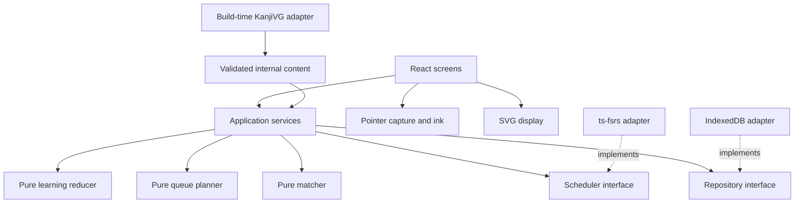

# Technical architecture

## Chosen stack

React + TypeScript strict + Vite, npm lockfile, CSS, native Pointer Events, Canvas 2D for ink, SVG for references, IndexedDB behind a small repository, `ts-fsrs` for scheduling, and `vite-plugin-pwa` for static offline caching. Use Vitest for pure logic, Testing Library for UI behavior, and Playwright Chromium/WebKit for browser flows.

M0 pins compatible stable releases and a supported Node LTS. `idb` is a reasonable thin IndexedDB helper; adopt it when M4 starts. A small SVG-path geometry library may be selected in M2 after license/accuracy review. Prefer it over writing an entire SVG parser. No router dependency is needed for three hash routes. No global state library or CSS framework is required.

## Dependency map

The composition root instantiates adapters and injects them. UI dispatches intent and renders application results. Application services orchestrate grading and persistence; they do not do curve math or render. Domain code uses plain values and pure functions; adapters handle external formats/APIs. No circular imports or direct component calls to `ts-fsrs`/IndexedDB.

## Module responsibilities

| Module | Owns | Must not own |
| --- | --- | --- |
| `app` | Initialization, dependency wiring, hash navigation, foreground refresh | Recognition formulas |
| `ui` | Home, session, settings, feedback, accessibility | Scheduling rules, direct storage |
| `drawing` | Pointer lifecycle, active stroke, ink canvas, SVG animation | Pass/fail or FSRS decisions |
| `matching` | Sampling, geometry features, thresholds, ordered match diagnostics | React, DOM, persistence, timing policy |
| `domain` | Contract types, learning reducer, queue planner, attempt orchestration | Raw SVG import, browser storage calls |
| `scheduling` | FSRS configuration, rating translation, card serialization | Learning presentation or session queue |
| `persistence` | Record validation, atomic commit, revision checks, migration | UI decisions or matcher thresholds |
| `data` | Read-only generated content, lookup and schema checks | Mutable progress |
| `scripts` | Pinned-source conversion, validation, provenance | Live application behavior |

Store high-frequency active ink in a drawing controller/ref. Schedule paint with `requestAnimationFrame`; do not re-render the entire React screen for each pointer sample. Commit completed strokes to attempt state. Resize rebuilds render surfaces from normalized points; it must not modify recognition geometry.

Use one aligned coordinate frame for reference display, ink, and scoring. Display smoothing must not change captured recognition points. SVG references are rendered from approved internal `d` values; never inject raw upstream XML/HTML into the UI.

## The grade boundary

1. UI emits `Check` with current attempt ID and completed strokes.
2. Application verifies that the attempt is ungraded, no pointer is active, and reference/settings versions match the session.
3. Pure matcher returns the verdict and diagnostics.
4. Pure transition logic calculates next pedagogical state and optional rating intent.
5. Scheduler adapter computes the next card/log only when rating intent exists, using one captured time.
6. Repository atomically writes event, progress, and session/result using an expected revision.
7. Only after transaction completion does UI show a saved result. Retry uses the same attempt ID; a stale revision requires refreshing state, not silently overwriting it.

This is a single local application transaction, not distributed sync or a full event-sourcing framework. Logs support explanation, tests, and future mapping; stored progress is the working state.

## Scope boundaries for future Anki

Give each character and writing card independent stable IDs. Model review history with UTC timestamps and explicit origin (`initial-learning` or `scheduled-review`). A future adapter can map Anki note/card IDs to these IDs. Preserve scheduler configuration/version with logs because matching algorithms and schedules can change.

Do not implement Anki APIs, credentials, polling, a generic sync engine, or claim that local FSRS fields alone guarantee Anki parity. Before sync, decide which system owns scheduling, deck/timezone policy, card templates, ID mapping, duplicates, and conflicts. Those are future product decisions.

## Delivery constraints

Implement risk in order: physical drawing → meaningful geometry → state transitions → durable scheduling → sessions → 50-card quality → offline → polish. See [implementation plan](implementation-plan.md). Broaden only after the vertical slice proves the input assumptions. Do not compensate for an unreliable matcher with elaborate UI or silently remove correctness checks.
